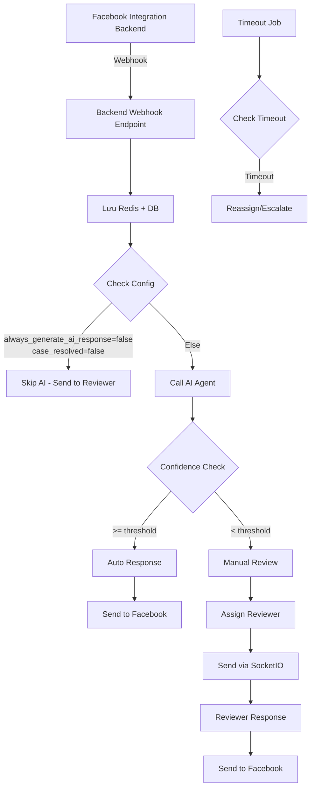
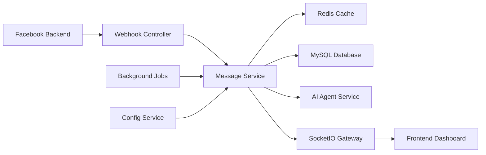

# 🤖 Giải pháp xử lý tin nhắn với AI Agent - Phân tích chi tiết

## 📋 Mục lục

- [🎯 Tổng quan luồng xử lý](#-tổng-quan-luồng-xử-lý)
- [🏗️ Kiến trúc hệ thống](#️-kiến-trúc-hệ-thống)
- [📡 Webhook từ Facebook Backend](#-webhook-từ-facebook-backend)
- [🔄 Redis Services](#-redis-services)
- [📊 Database Operations](#-database-operations)
- [🤖 AI Agent Integration](#-ai-agent-integration)
- [🔌 SocketIO Real-time Communication](#-socketio-real-time-communication)
- [⚙️ Background Jobs](#️-background-jobs)
- [🌐 APIs cho Frontend Dashboard](#-apis-cho-frontend-dashboard)
- [📋 Workflow Implementation](#-workflow-implementation)
- [🚀 Implementation Plan](#-implementation-plan)

---

## 🎯 Tổng quan luồng xử lý

### Luồng chính (Message Flow)



### Các trạng thái tin nhắn

1. **received** - Tin nhắn mới nhận từ Facebook
2. **wait_ai_agent** - Đang chờ AI xử lý
3. **ai_agent_done_auto** - AI hoàn thành, tự động trả lời
4. **ai_agent_done_need_manual** - AI hoàn thành, cần manual review
5. **skip_ai_sent_to_reviewer** - Bỏ qua AI, gửi trực tiếp cho reviewer
6. **sent_to_reviewer** - Đã gửi cho reviewer
7. **sent_to_reviewer_sent_waiting_message** - Đã gửi cho reviewer + waiting message
8. **reviewer_replied** - Reviewer đã trả lời
9. **auto_response_done** - Hoàn thành auto response
10. **manual_response_done** - Hoàn thành manual response

---

## 🏗️ Kiến trúc hệ thống

### Các thành phần chính



### Tech Stack cho từng thành phần

| Thành phần             | Technology         | Vai trò                           |
| ---------------------- | ------------------ | --------------------------------- |
| **Webhook Controller** | NestJS Controller  | Nhận tin nhắn từ Facebook Backend |
| **Message Service**    | NestJS Service     | Business logic xử lý tin nhắn     |
| **Redis Cache**        | Redis + ioredis    | Cache tin nhắn, session reviewer  |
| **MySQL Database**     | TypeORM + MySQL    | Lưu trữ lâu dài                   |
| **AI Agent Service**   | HTTP Client        | Gọi API AI Agent external         |
| **SocketIO Gateway**   | socket.io          | Real-time communication           |
| **Background Jobs**    | Bull Queue + Redis | Xử lý bất đồng bộ                 |
| **Config Service**     | Custom Service     | Quản lý cấu hình động             |

---

## 📡 Webhook từ Facebook Backend

### 1. Webhook Endpoint

**Endpoint:** `POST /webhook/facebook/message`

**Mục đích:** Nhận tin nhắn mới từ Facebook Integration Backend

**Request Body:**

```typescript
interface FacebookWebhookPayload {
  messageId: string; // ID tin nhắn từ Facebook
  conversationId?: string; // ID conversation (nếu có)
  customerId: string; // ID khách hàng
  content: string; // Nội dung tin nhắn
  timestamp: string; // Thời gian tin nhắn (ISO 8601)
  customerInfo: {
    // Thông tin khách hàng từ Facebook
    facebookId: string;
    facebookName?: string;
    profileUrl?: string;
    avatarUrl?: string;
  };
}
```

**Tại sao cần Webhook:**

- **Real-time processing**: Nhận tin nhắn ngay khi khách hàng gửi
- **Decoupling**: Tách biệt Facebook integration và business logic
- **Reliability**: Retry mechanism nếu backend tạm thời down
- **Security**: Facebook Backend có thể authenticate qua API key

### 2. Webhook Controller Implementation

```typescript
@Controller('webhook')
@ApiTags('Webhook')
export class WebhookController {
  constructor(
    private readonly messageService: MessageService,
    private readonly logger: Logger,
  ) {}

  @Post('facebook/message')
  @ApiOperation({ summary: 'Nhận tin nhắn từ Facebook Backend' })
  @HttpCode(200)
  async receiveMessage(
    @Body() payload: FacebookWebhookPayload,
    @Headers('x-api-key') apiKey: string,
  ): Promise<BaseResponse> {
    try {
      // 1. Validate API key
      await this.validateApiKey(apiKey);

      // 2. Validate payload
      await this.validatePayload(payload);

      // 3. Process message (async)
      await this.messageService.processIncomingMessage(payload);

      return HttpResponse.success(null, 'Tin nhắn đã được nhận');
    } catch (error) {
      this.logger.error('Webhook error:', error);
      throw error;
    }
  }
}
```

---

## 🔄 Redis Services

### 1. Message Cache Service

**Mục đích:** Cache tin nhắn đang xử lý và queue gửi về Facebook

**Redis Keys Structure:**

```
processing_messages:{messageId}     # Tin nhắn đang xử lý
facebook_response_queue            # Queue tin nhắn cần gửi về Facebook
reviewer_sessions:{userId}         # Session của reviewer online
conversation_cache:{conversationId} # Cache conversation metadata
```

**Implementation:**

```typescript
@Injectable()
export class MessageCacheService {
  constructor(private readonly redisService: RedisService) {}

  // Cache tin nhắn đang xử lý
  async cacheProcessingMessage(messageId: string, data: any): Promise<void> {
    const key = `processing_messages:${messageId}`;
    await this.redisService.setex(key, 3600, JSON.stringify(data)); // 1 hour TTL
  }

  // Queue tin nhắn cần gửi về Facebook
  async queueFacebookResponse(response: FacebookResponse): Promise<void> {
    await this.redisService.lpush(
      'facebook_response_queue',
      JSON.stringify(response),
    );
  }

  // Cache session reviewer
  async cacheReviewerSession(userId: string, socketId: string): Promise<void> {
    const key = `reviewer_sessions:${userId}`;
    const sessionData = {
      socketId,
      connectedAt: new Date().toISOString(),
      lastActivity: new Date().toISOString(),
    };
    await this.redisService.setex(key, 86400, JSON.stringify(sessionData)); // 24 hours
  }
}
```

**Tại sao cần Redis:**

- **Performance**: Access nhanh hơn database cho data tạm thời
- **Reliability**: Backup tin nhắn khi processing để tránh mất data
- **Scalability**: Support multiple instances của backend
- **Real-time**: Cache session reviewer để biết ai đang online

### 2. Conversation Cache Service

**Mục đích:** Cache metadata của conversation để tối ưu performance

```typescript
@Injectable()
export class ConversationCacheService {
  constructor(private readonly redisService: RedisService) {}

  async cacheConversation(
    conversationId: string,
    data: ConversationCache,
  ): Promise<void> {
    const key = `conversation_cache:${conversationId}`;
    await this.redisService.setex(key, 1800, JSON.stringify(data)); // 30 minutes
  }

  async getConversationCache(
    conversationId: string,
  ): Promise<ConversationCache | null> {
    const key = `conversation_cache:${conversationId}`;
    const cached = await this.redisService.get(key);
    return cached ? JSON.parse(cached) : null;
  }
}

interface ConversationCache {
  customerId: string;
  customerType?: string;
  assignedReviewerId?: string;
  caseResolved: boolean;
  lastMessageAt: string;
  totalMessages: number;
}
```

---

## 📊 Database Operations

### 1. Customer Operations

**Mục đích:** Quản lý thông tin khách hàng từ Facebook và AI analysis

```typescript
@Injectable()
export class CustomerService {
  constructor(
    @InjectRepository(Customer)
    private readonly customerRepository: Repository<Customer>,
  ) {}

  async createOrUpdateCustomer(
    customerInfo: FacebookCustomerInfo,
  ): Promise<Customer> {
    // Tìm customer theo facebookId
    let customer = await this.customerRepository.findOne({
      where: { facebookId: customerInfo.facebookId },
    });

    if (!customer) {
      // Tạo customer mới
      customer = this.customerRepository.create({
        id: uuid(),
        facebookId: customerInfo.facebookId,
        facebookName: customerInfo.facebookName,
        facebookProfileUrl: customerInfo.profileUrl,
        facebookAvatarUrl: customerInfo.avatarUrl,
        firstInteractionAt: new Date(),
      });
    } else {
      // Update thông tin từ Facebook (có thể thay đổi)
      customer.facebookName =
        customerInfo.facebookName || customer.facebookName;
      customer.facebookAvatarUrl =
        customerInfo.avatarUrl || customer.facebookAvatarUrl;
    }

    customer.lastInteractionAt = new Date();
    customer.totalConversations = customer.totalConversations || 0;
    customer.totalMessages = (customer.totalMessages || 0) + 1;

    return await this.customerRepository.save(customer);
  }

  async updateCustomerAnalysis(
    customerId: string,
    aiAnalysis: AIAnalysisResult,
  ): Promise<void> {
    await this.customerRepository.update(customerId, {
      customerTypeId: aiAnalysis.customerTypeId,
      intentAnalysis: aiAnalysis.intentAnalysis,
      behaviorAnalysis: aiAnalysis.behaviorAnalysis,
      interactionHistory: aiAnalysis.interactionHistory,
    });
  }
}
```

**Tại sao cần Customer Operations:**

- **Data Integration**: Kết hợp data từ Facebook và AI analysis
- **Customer Journey**: Theo dõi hành trình khách hàng
- **Personalization**: Cá nhân hóa response dựa trên lịch sử
- **Analytics**: Phân tích behavior pattern

### 2. Conversation Operations

**Mục đích:** Quản lý cuộc trò chuyện và phân công reviewer

```typescript
@Injectable()
export class ConversationService {
  constructor(
    @InjectRepository(Conversation)
    private readonly conversationRepository: Repository<Conversation>,
  ) {}

  async findOrCreateConversation(
    customerId: string,
    conversationId?: string,
  ): Promise<Conversation> {
    if (conversationId) {
      const existing = await this.conversationRepository.findOne({
        where: { id: conversationId },
      });
      if (existing) return existing;
    }

    // Tìm conversation active gần nhất của customer
    const activeConversation = await this.conversationRepository.findOne({
      where: {
        customerId,
        status: 'active',
      },
      order: { startedAt: 'DESC' },
    });

    if (activeConversation && !activeConversation.caseResolved) {
      return activeConversation;
    }

    // Tạo conversation mới
    const newConversation = this.conversationRepository.create({
      id: uuid(),
      customerId,
      status: 'active',
      caseResolved: false,
      startedAt: new Date(),
      totalMessages: 0,
    });

    return await this.conversationRepository.save(newConversation);
  }

  async assignReviewer(
    conversationId: string,
    reviewerId: string,
  ): Promise<void> {
    await this.conversationRepository.update(conversationId, {
      assignedReviewerId: reviewerId,
    });
  }
}
```

### 3. Message Operations

**Mục đích:** Lưu trữ và quản lý trạng thái tin nhắn

```typescript
@Injectable()
export class MessageRepository {
  constructor(
    @InjectRepository(Message)
    private readonly messageRepository: Repository<Message>,
  ) {}

  async createMessage(data: CreateMessageData): Promise<Message> {
    const message = this.messageRepository.create({
      id: uuid(),
      conversationId: data.conversationId,
      customerId: data.customerId,
      senderId: data.senderId,
      senderType: data.senderType,
      content: data.content,
      status: 'received',
      facebookMessageId: data.facebookMessageId,
      createdAt: new Date(),
    });

    return await this.messageRepository.save(message);
  }

  async updateMessageStatus(
    messageId: string,
    status: MessageStatus,
    additionalData?: any,
  ): Promise<void> {
    const updateData: any = {
      status,
      updatedAt: new Date(),
    };

    if (additionalData) {
      Object.assign(updateData, additionalData);
    }

    await this.messageRepository.update(messageId, updateData);
  }

  async findPendingMessages(): Promise<Message[]> {
    return await this.messageRepository.find({
      where: {
        status: In([
          'wait_ai_agent',
          'ai_agent_done_need_manual',
          'sent_to_reviewer',
        ]),
      },
      relations: ['conversation', 'conversation.customer'],
      order: { createdAt: 'ASC' },
    });
  }
}
```

---

## 🤖 AI Agent Integration

### 1. AI Agent Service

**Mục đích:** Gọi API AI Agent để phân tích tin nhắn và tạo response

```typescript
@Injectable()
export class AIAgentService {
  private readonly httpService: HttpService;

  constructor() {
    this.httpService = new HttpService();
  }

  async analyzeMessage(
    question: string,
    customerHistory?: any,
  ): Promise<AIAgentResponse> {
    try {
      const response = await this.httpService
        .post(
          'http://127.137.129.161:8080/api',
          {
            question,
            api_key: process.env.AI_AGENT_API_KEY || 'None',
            model_name: await this.configService.getConfig(
              'AI_MODEL_NAME',
              'gpt-4.1',
            ),
            customer_history: customerHistory,
          },
          {
            timeout: 30000, // 30 seconds timeout
            headers: {
              'Content-Type': 'application/json',
            },
          },
        )
        .toPromise();

      return this.parseAIResponse(response.data);
    } catch (error) {
      this.logger.error('AI Agent call failed:', error);
      throw new HttpException(
        'AI Agent không khả dụng',
        HttpStatus.SERVICE_UNAVAILABLE,
      );
    }
  }

  private parseAIResponse(data: any): AIAgentResponse {
    return {
      answer: data.answer,
      confidence: parseFloat(data.confidence),
      clarifiedQuery: data.clarified_query,
      customerType: data.customer_type,
      keyInformation: data.key_information,
      mainTopic: data.main_topic,
      originalQuestion: data.question,
    };
  }
}

interface AIAgentResponse {
  answer: string;
  confidence: number; // 0-100
  clarifiedQuery: string;
  customerType: string; // enum CustomerType
  keyInformation: string;
  mainTopic: string;
  originalQuestion: string;
}
```

**Tại sao cần AI Agent Service:**

- **Automation**: Tự động trả lời câu hỏi thường gặp
- **Customer Analysis**: Phân loại khách hàng và intent
- **Quality Assurance**: Đánh giá confidence để quyết định auto/manual
- **Knowledge Extraction**: Trích xuất keyword và topic để phân loại

### 2. AI Processing Service

**Mục đích:** Orchestrate việc gọi AI và xử lý kết quả

```typescript
@Injectable()
export class AIProcessingService {
  constructor(
    private readonly aiAgentService: AIAgentService,
    private readonly configService: ConfigService,
    private readonly customerService: CustomerService,
  ) {}

  async processMessageWithAI(
    message: Message,
    customer: Customer,
  ): Promise<AIProcessingResult> {
    // 1. Chuẩn bị context cho AI
    const customerHistory = await this.buildCustomerHistory(customer);

    // 2. Gọi AI Agent
    const aiResponse = await this.aiAgentService.analyzeMessage(
      message.content,
      customerHistory,
    );

    // 3. Cập nhật customer analysis
    await this.updateCustomerFromAI(customer, aiResponse);

    // 4. Quyết định auto/manual dựa trên confidence
    const confidenceThreshold =
      await this.configService.getAiConfidenceThreshold();
    const shouldAutoReply = aiResponse.confidence >= confidenceThreshold;

    return {
      aiResponse,
      shouldAutoReply,
      customerTypeUpdated:
        aiResponse.customerType !== customer.customerType?.name,
    };
  }

  private async buildCustomerHistory(customer: Customer): Promise<any> {
    return {
      customerType: customer.customerType?.name,
      previousInteractions: customer.interactionHistory,
      totalMessages: customer.totalMessages,
      lastInteractionAt: customer.lastInteractionAt,
    };
  }

  private async updateCustomerFromAI(
    customer: Customer,
    aiResponse: AIAgentResponse,
  ): Promise<void> {
    // Update customer type nếu AI phân tích ra type mới
    if (
      aiResponse.customerType &&
      aiResponse.customerType !== customer.customerType?.name
    ) {
      const customerType = await this.findCustomerTypeByName(
        aiResponse.customerType,
      );
      if (customerType) {
        await this.customerService.updateCustomerType(
          customer.id,
          customerType.id,
        );
      }
    }

    // Update intent và behavior analysis
    await this.customerService.updateCustomerAnalysis(customer.id, {
      intentAnalysis: {
        mainTopic: aiResponse.mainTopic,
        keyInformation: aiResponse.keyInformation,
        clarifiedQuery: aiResponse.clarifiedQuery,
        analyzedAt: new Date().toISOString(),
      },
      behaviorAnalysis: customer.behaviorAnalysis || {},
    });
  }
}
```

---

## 🔌 SocketIO Real-time Communication

### 1. SocketIO Gateway

**Mục đích:** Real-time communication giữa backend và frontend dashboard

```typescript
@WebSocketGateway({
  cors: {
    origin: process.env.FRONTEND_URL,
    credentials: true,
  },
})
export class ChatGateway implements OnGatewayConnection, OnGatewayDisconnect {
  @WebSocketServer() server: Server;

  constructor(
    private readonly messageCacheService: MessageCacheService,
    private readonly userService: UserService,
  ) {}

  async handleConnection(client: Socket): Promise<void> {
    try {
      // Validate JWT token từ handshake
      const token = client.handshake.auth.token;
      const user = await this.validateToken(token);

      client.data.userId = user.id;
      client.data.user = user;

      // Cache reviewer session
      await this.messageCacheService.cacheReviewerSession(user.id, client.id);

      this.logger.log(`Reviewer ${user.username} connected: ${client.id}`);
    } catch (error) {
      client.disconnect();
    }
  }

  async handleDisconnect(client: Socket): Promise<void> {
    if (client.data.userId) {
      await this.messageCacheService.removeReviewerSession(client.data.userId);
      this.logger.log(`Reviewer ${client.data.user.username} disconnected`);
    }
  }

  // Event: Reviewer gửi tin nhắn
  @SubscribeMessage('send_message')
  async handleSendMessage(
    client: Socket,
    payload: SendMessagePayload,
  ): Promise<void> {
    try {
      const userId = client.data.userId;

      // Validate payload
      await this.validateSendMessagePayload(payload);

      // Process message
      await this.messageService.processReviewerMessage({
        conversationId: payload.conversationId,
        senderId: userId,
        content: payload.content,
      });

      // Acknowledge thành công
      client.emit('message_sent', {
        success: true,
        conversationId: payload.conversationId,
      });
    } catch (error) {
      client.emit('message_error', {
        error: error.message,
        conversationId: payload.conversationId,
      });
    }
  }

  // Method: Gửi tin nhắn mới đến reviewer
  async sendMessageToReviewer(
    reviewerId: string,
    message: MessageForReviewer,
  ): Promise<void> {
    const session = await this.messageCacheService.getReviewerSession(
      reviewerId,
    );

    if (session) {
      this.server.to(session.socketId).emit('receive_message', message);
    }
  }

  // Method: Broadcast notification
  async broadcastNotification(notification: Notification): Promise<void> {
    this.server.emit('notification', notification);
  }
}
```

**Events định nghĩa:**

| Event                  | Direction       | Purpose                          |
| ---------------------- | --------------- | -------------------------------- |
| `connect_socket`       | Client → Server | Đăng ký reviewer online          |
| `send_message`         | Client → Server | Reviewer gửi tin nhắn            |
| `receive_message`      | Server → Client | Gửi tin nhắn mới đến reviewer    |
| `message_sent`         | Server → Client | Acknowledge tin nhắn đã gửi      |
| `message_error`        | Server → Client | Thông báo lỗi                    |
| `notification`         | Server → Client | Thông báo chung                  |
| `conversation_updated` | Server → Client | Cập nhật trạng thái conversation |

**Tại sao cần SocketIO:**

- **Real-time**: Tin nhắn được gửi ngay lập tức đến reviewer
- **Bi-directional**: Support both incoming và outgoing messages
- **Connection Management**: Theo dõi reviewer nào đang online
- **Scalability**: Support multiple concurrent connections

### 2. Message Distribution Service

**Mục đích:** Phân phối tin nhắn đến reviewer phù hợp

```typescript
@Injectable()
export class MessageDistributionService {
  constructor(
    private readonly chatGateway: ChatGateway,
    private readonly configService: ConfigService,
    private readonly userService: UserService,
  ) {}

  async distributeToReviewer(
    message: Message,
    conversation: Conversation,
  ): Promise<string> {
    // 1. Tìm reviewer phù hợp
    const reviewerId = await this.findSuitableReviewer(
      conversation.customerId,
      conversation.customerType,
    );

    // 2. Assign reviewer cho conversation
    await this.conversationService.assignReviewer(conversation.id, reviewerId);

    // 3. Gửi via SocketIO
    await this.chatGateway.sendMessageToReviewer(reviewerId, {
      messageId: message.id,
      conversationId: conversation.id,
      customerId: conversation.customerId,
      content: message.content,
      autoResponse: message.autoResponse,
      confidence: message.confidenceScore,
      customerInfo: conversation.customer,
      createdAt: message.createdAt,
    });

    // 4. Update message status
    await this.messageRepository.updateMessageStatus(
      message.id,
      'sent_to_reviewer',
      { assignedReviewerId: reviewerId },
    );

    return reviewerId;
  }

  private async findSuitableReviewer(
    customerId: string,
    customerType?: string,
  ): Promise<string> {
    const strategy = await this.configService.getAutoAssignStrategy();

    switch (strategy) {
      case 'round_robin':
        return this.roundRobinAssignment(customerType);
      case 'load_based':
        return this.loadBasedAssignment(customerType);
      case 'expertise_based':
        return this.expertiseBasedAssignment(customerType);
      default:
        return this.roundRobinAssignment(customerType);
    }
  }
}
```

---

## ⚙️ Background Jobs

### 1. Job Queue Setup

**Mục đích:** Xử lý các tác vụ bất đồng bộ và định kỳ

```typescript
// job-queue.module.ts
@Module({
  imports: [
    BullModule.forRootAsync({
      useFactory: () => ({
        redis: {
          host: process.env.REDIS_HOST,
          port: parseInt(process.env.REDIS_PORT),
        },
      }),
    }),
    BullModule.registerQueue(
      { name: 'ai-processing' },
      { name: 'facebook-response' },
      { name: 'timeout-check' },
      { name: 'message-distribution' },
    ),
  ],
})
export class JobQueueModule {}
```

### 2. AI Processing Job

**Mục đích:** Xử lý tin nhắn với AI Agent bất đồng bộ

```typescript
@Processor('ai-processing')
export class AIProcessingProcessor {
  constructor(
    private readonly messageService: MessageService,
    private readonly aiProcessingService: AIProcessingService,
  ) {}

  @Process('analyze-message')
  async processAIAnalysis(job: Job<AIProcessingJobData>): Promise<void> {
    const { messageId, conversationId, customerId } = job.data;

    try {
      // 1. Load message và customer data
      const message = await this.messageService.findById(messageId);
      const customer = await this.customerService.findById(customerId);

      // 2. Update status thành wait_ai_agent
      await this.messageRepository.updateMessageStatus(
        messageId,
        'wait_ai_agent',
      );

      // 3. Gọi AI processing
      const result = await this.aiProcessingService.processMessageWithAI(
        message,
        customer,
      );

      // 4. Update message với AI response
      await this.messageRepository.updateMessageStatus(
        messageId,
        result.shouldAutoReply
          ? 'ai_agent_done_auto'
          : 'ai_agent_done_need_manual',
        {
          autoResponse: result.aiResponse.answer,
          confidenceScore: result.aiResponse.confidence,
          processedAt: new Date(),
        },
      );

      // 5. Nếu auto reply thì queue gửi về Facebook
      if (result.shouldAutoReply) {
        await this.queueFacebookResponse(messageId, result.aiResponse.answer);
      } else {
        // Nếu manual thì queue phân phối reviewer
        await this.queueReviewerDistribution(messageId, conversationId);
      }
    } catch (error) {
      this.logger.error(
        `AI processing failed for message ${messageId}:`,
        error,
      );

      // Fallback: Gửi trực tiếp cho reviewer
      await this.messageRepository.updateMessageStatus(
        messageId,
        'skip_ai_sent_to_reviewer',
        {
          skipAiReason: error.message,
        },
      );

      await this.queueReviewerDistribution(messageId, conversationId);
    }
  }

  private async queueFacebookResponse(
    messageId: string,
    response: string,
  ): Promise<void> {
    await this.facebookResponseQueue.add('send-response', {
      messageId,
      response,
    });
  }

  private async queueReviewerDistribution(
    messageId: string,
    conversationId: string,
  ): Promise<void> {
    await this.messageDistributionQueue.add('distribute-message', {
      messageId,
      conversationId,
    });
  }
}
```

### 3. Facebook Response Job

**Mục đích:** Gửi response về Facebook Backend

```typescript
@Processor('facebook-response')
export class FacebookResponseProcessor {
  constructor(
    private readonly httpService: HttpService,
    private readonly configService: ConfigService,
  ) {}

  @Process('send-response')
  async sendToFacebook(job: Job<FacebookResponseJobData>): Promise<void> {
    const { messageId, response, conversationId, customerId } = job.data;

    try {
      // 1. Load message data
      const message = await this.messageService.findById(messageId);

      // 2. Call Facebook Backend API
      await this.callFacebookBackend({
        originalMessageId: message.facebookMessageId,
        response,
        customerId,
        timestamp: new Date().toISOString(),
      });

      // 3. Update message status
      await this.messageRepository.updateMessageStatus(
        messageId,
        message.senderType === 'bot'
          ? 'auto_response_done'
          : 'manual_response_done',
        { respondedAt: new Date() },
      );

      this.logger.log(`Response sent to Facebook for message ${messageId}`);
    } catch (error) {
      this.logger.error(`Failed to send response to Facebook:`, error);

      // Retry mechanism
      if (job.attemptsMade < 3) {
        throw error; // Will trigger retry
      }

      // Max retries reached - mark as failed
      await this.messageRepository.updateMessageStatus(
        messageId,
        'failed_to_send',
      );
    }
  }

  private async callFacebookBackend(
    payload: FacebookResponsePayload,
  ): Promise<void> {
    const facebookBackendUrl = await this.configService.getConfig(
      'FACEBOOK_BACKEND_URL',
    );
    const apiKey = await this.configService.getConfig(
      'FACEBOOK_BACKEND_API_KEY',
    );

    await this.httpService
      .post(`${facebookBackendUrl}/api/send-message`, payload, {
        headers: {
          'Content-Type': 'application/json',
          'X-API-Key': apiKey,
        },
        timeout: 10000,
      })
      .toPromise();
  }
}
```

### 4. Timeout Check Job

**Mục đích:** Kiểm tra và xử lý timeout của reviewer

```typescript
@Processor('timeout-check')
export class TimeoutCheckProcessor {
  constructor(
    private readonly messageService: MessageService,
    private readonly configService: ConfigService,
  ) {}

  @Cron('*/5 * * * *') // Chạy mỗi 5 phút
  @Process('check-timeouts')
  async checkReviewerTimeouts(): Promise<void> {
    const timeoutMinutes = await this.configService.getReviewerTimeoutMinutes();
    const maxRetryCount = await this.configService.getMaxRetryCount();

    // Tìm messages đã gửi cho reviewer và quá thời gian timeout
    const timeoutMessages = await this.messageRepository.find({
      where: {
        status: In([
          'sent_to_reviewer',
          'sent_to_reviewer_sent_waiting_message',
        ]),
        updatedAt: LessThan(new Date(Date.now() - timeoutMinutes * 60 * 1000)),
      },
      relations: ['conversation'],
    });

    for (const message of timeoutMessages) {
      try {
        if (message.retryCount < maxRetryCount) {
          // Retry - reassign to another reviewer
          await this.reassignMessage(message);
        } else {
          // Max retry reached - escalate
          await this.escalateMessage(message);
        }
      } catch (error) {
        this.logger.error(
          `Failed to handle timeout for message ${message.id}:`,
          error,
        );
      }
    }
  }

  private async reassignMessage(message: Message): Promise<void> {
    // 1. Increment retry count
    await this.messageRepository.updateMessageStatus(
      message.id,
      'ai_agent_done_need_manual',
      {
        retryCount: message.retryCount + 1,
      },
    );

    // 2. Unassign current reviewer
    await this.conversationService.unassignReviewer(message.conversationId);

    // 3. Queue for redistribution
    await this.messageDistributionQueue.add('distribute-message', {
      messageId: message.id,
      conversationId: message.conversationId,
      isRetry: true,
    });

    this.logger.log(
      `Message ${message.id} reassigned due to timeout (retry ${
        message.retryCount + 1
      })`,
    );
  }

  private async escalateMessage(message: Message): Promise<void> {
    // 1. Mark as escalated
    await this.messageRepository.updateMessageStatus(message.id, 'escalated');

    // 2. Notify supervisors
    await this.notificationService.notifyEscalation(message);

    // 3. Auto-reply với fallback message
    const fallbackMessage = await this.configService.getConfig(
      'FALLBACK_MESSAGE',
      'Chúng tôi sẽ liên hệ với bạn sớm nhất có thể. Xin lỗi vì sự bất tiện này.',
    );

    await this.queueFacebookResponse(message.id, fallbackMessage);

    this.logger.warn(`Message ${message.id} escalated after max retries`);
  }
}
```

### 5. Message Distribution Job

**Mục đích:** Phân phối tin nhắn đến reviewer

```typescript
@Processor('message-distribution')
export class MessageDistributionProcessor {
  constructor(
    private readonly messageDistributionService: MessageDistributionService,
    private readonly configService: ConfigService,
  ) {}

  @Process('distribute-message')
  async distributeMessage(job: Job<MessageDistributionJobData>): Promise<void> {
    const { messageId, conversationId, isRetry = false } = job.data;

    try {
      // 1. Load message và conversation
      const message = await this.messageService.findById(messageId);
      const conversation = await this.conversationService.findById(
        conversationId,
      );

      // 2. Kiểm tra config có gửi waiting message không
      const enableWaitingMessage =
        await this.configService.isWaitingMessageEnabled();

      if (enableWaitingMessage && !isRetry) {
        await this.sendWaitingMessage(message, conversation);
      }

      // 3. Phân phối đến reviewer
      const reviewerId =
        await this.messageDistributionService.distributeToReviewer(
          message,
          conversation,
        );

      this.logger.log(
        `Message ${messageId} distributed to reviewer ${reviewerId}`,
      );
    } catch (error) {
      this.logger.error(`Failed to distribute message ${messageId}:`, error);

      // Retry after delay
      if (job.attemptsMade < 3) {
        throw error;
      }

      // Fallback: Send auto-reply
      await this.sendFallbackResponse(messageId);
    }
  }

  private async sendWaitingMessage(
    message: Message,
    conversation: Conversation,
  ): Promise<void> {
    const waitingContent = await this.configService.getWaitingMessageContent();

    // Tạo waiting message
    const waitingMessage = await this.messageRepository.createMessage({
      conversationId: conversation.id,
      customerId: conversation.customerId,
      senderId: null, // System message
      senderType: 'bot',
      content: waitingContent,
    });

    // Queue gửi về Facebook
    await this.facebookResponseQueue.add('send-response', {
      messageId: waitingMessage.id,
      response: waitingContent,
      conversationId: conversation.id,
      customerId: conversation.customerId,
    });

    // Update original message status
    await this.messageRepository.updateMessageStatus(
      message.id,
      'sent_to_reviewer_sent_waiting_message',
    );
  }
}
```

---

## 🌐 APIs cho Frontend Dashboard

### 1. Chat APIs

**Mục đích:** APIs để frontend dashboard hiển thị và quản lý chat

#### Get Conversations List

```typescript
@Controller('chat')
@ApiTags('Chat')
@ApiBearerAuth()
@UseGuards(JwtAuthenticationGuard, PermissionsGuard)
@Permissions(PermissionName.CHAT)
export class ChatController {
  constructor(
    private readonly conversationService: ConversationService,
    private readonly messageService: MessageService,
  ) {}

  @Get('conversations')
  @ApiOperation({ summary: 'Lấy danh sách conversations của reviewer' })
  async getConversations(
    @Req() request: RequestWithUser,
    @Query() query: GetConversationsDto,
  ): Promise<BaseResponse> {
    try {
      const userId = request.user.id;

      const conversations = await this.conversationService.findByReviewer(
        userId,
        {
          status: query.status,
          caseResolved: query.caseResolved,
          page: query.page || 1,
          limit: query.limit || 20,
        },
      );

      return HttpResponse.success(
        conversations,
        'Lấy danh sách conversations thành công',
      );
    } catch (error) {
      throw new HttpException(
        'Lấy danh sách conversations thất bại',
        HttpStatus.INTERNAL_SERVER_ERROR,
      );
    }
  }

  @Get('conversations/:conversationId/messages')
  @ApiOperation({ summary: 'Lấy messages trong conversation' })
  async getMessages(
    @Param('conversationId') conversationId: string,
    @Query() query: GetMessagesDto,
  ): Promise<BaseResponse> {
    try {
      const messages = await this.messageService.findByConversation(
        conversationId,
        {
          page: query.page || 1,
          limit: query.limit || 50,
          order: 'ASC', // Oldest first
        },
      );

      return HttpResponse.success(messages, 'Lấy messages thành công');
    } catch (error) {
      throw new HttpException(
        'Lấy messages thất bại',
        HttpStatus.INTERNAL_SERVER_ERROR,
      );
    }
  }

  @Post('conversations/:conversationId/resolve')
  @ApiOperation({ summary: 'Đánh dấu conversation đã resolved' })
  async resolveConversation(
    @Param('conversationId') conversationId: string,
    @Req() request: RequestWithUser,
  ): Promise<BaseResponse> {
    try {
      await this.conversationService.resolveConversation(
        conversationId,
        request.user.id,
      );

      return HttpResponse.success(
        null,
        'Conversation đã được đánh dấu resolved',
      );
    } catch (error) {
      throw new HttpException(
        'Không thể resolve conversation',
        HttpStatus.INTERNAL_SERVER_ERROR,
      );
    }
  }
}
```

#### DTOs

```typescript
export class GetConversationsDto {
  @IsOptional()
  @IsEnum(['active', 'inactive', 'closed'])
  status?: 'active' | 'inactive' | 'closed';

  @IsOptional()
  @IsBooleanString()
  caseResolved?: boolean;

  @IsOptional()
  @IsNumberString()
  page?: number;

  @IsOptional()
  @IsNumberString()
  limit?: number;
}

export class GetMessagesDto {
  @IsOptional()
  @IsNumberString()
  page?: number;

  @IsOptional()
  @IsNumberString()
  limit?: number;
}
```

### 2. Customer APIs

**Mục đích:** APIs để quản lý thông tin khách hàng

```typescript
@Controller('customers')
@ApiTags('Customer')
@ApiBearerAuth()
@UseGuards(JwtAuthenticationGuard, PermissionsGuard)
@Permissions(PermissionName.CHAT)
export class CustomerController {
  constructor(private readonly customerService: CustomerService) {}

  @Get(':customerId')
  @ApiOperation({ summary: 'Lấy thông tin chi tiết khách hàng' })
  async getCustomer(
    @Param('customerId') customerId: string,
  ): Promise<BaseResponse> {
    try {
      const customer = await this.customerService.findByIdWithDetails(
        customerId,
      );

      if (!customer) {
        throw new HttpException(
          'Khách hàng không tồn tại',
          HttpStatus.NOT_FOUND,
        );
      }

      const formattedCustomer = {
        ...customer,
        firstInteractionAt: formatDateToISO(customer.firstInteractionAt),
        lastInteractionAt: formatDateToISO(customer.lastInteractionAt),
      };

      return HttpResponse.success(
        formattedCustomer,
        'Lấy thông tin khách hàng thành công',
      );
    } catch (error) {
      if (error instanceof HttpException) {
        throw error;
      }
      throw new HttpException(
        'Lấy thông tin khách hàng thất bại',
        HttpStatus.INTERNAL_SERVER_ERROR,
      );
    }
  }

  @Put(':customerId/customer-type')
  @ApiOperation({ summary: 'Cập nhật customer type' })
  async updateCustomerType(
    @Param('customerId') customerId: string,
    @Body() body: UpdateCustomerTypeDto,
  ): Promise<BaseResponse> {
    try {
      await this.customerService.updateCustomerType(
        customerId,
        body.customerTypeId,
      );

      return HttpResponse.success(null, 'Cập nhật customer type thành công');
    } catch (error) {
      throw new HttpException(
        'Cập nhật customer type thất bại',
        HttpStatus.INTERNAL_SERVER_ERROR,
      );
    }
  }
}
```

### 3. Statistics APIs

**Mục đích:** APIs cung cấp thống kê cho dashboard

```typescript
@Controller('statistics')
@ApiTags('Statistics')
@ApiBearerAuth()
@UseGuards(JwtAuthenticationGuard, PermissionsGuard)
@Permissions(PermissionName.CHAT)
export class StatisticsController {
  constructor(private readonly statisticsService: StatisticsService) {}

  @Get('dashboard')
  @ApiOperation({ summary: 'Lấy thống kê dashboard' })
  async getDashboardStats(
    @Req() request: RequestWithUser,
    @Query() query: DashboardStatsDto,
  ): Promise<BaseResponse> {
    try {
      const stats = await this.statisticsService.getDashboardStats(
        request.user.id,
        query.fromDate ? new Date(query.fromDate) : undefined,
        query.toDate ? new Date(query.toDate) : undefined,
      );

      return HttpResponse.success(stats, 'Lấy thống kê thành công');
    } catch (error) {
      throw new HttpException(
        'Lấy thống kê thất bại',
        HttpStatus.INTERNAL_SERVER_ERROR,
      );
    }
  }

  @Get('ai-performance')
  @ApiOperation({ summary: 'Thống kê hiệu suất AI' })
  async getAIPerformance(): Promise<BaseResponse> {
    try {
      const performance = await this.statisticsService.getAIPerformanceStats();

      return HttpResponse.success(performance, 'Lấy thống kê AI thành công');
    } catch (error) {
      throw new HttpException(
        'Lấy thống kê AI thất bại',
        HttpStatus.INTERNAL_SERVER_ERROR,
      );
    }
  }
}
```

---

## 📋 Workflow Implementation

### 1. Main Message Processing Flow

```typescript
@Injectable()
export class MessageProcessingWorkflow {
  constructor(
    private readonly configService: ConfigService,
    private readonly conversationService: ConversationService,
    private readonly messageRepository: MessageRepository,
    private readonly aiProcessingQueue: Queue,
    private readonly messageDistributionQueue: Queue,
  ) {}

  async processIncomingMessage(payload: FacebookWebhookPayload): Promise<void> {
    try {
      // 1. Create or find customer
      const customer = await this.customerService.createOrUpdateCustomer(
        payload.customerInfo,
      );

      // 2. Create or find conversation
      const conversation =
        await this.conversationService.findOrCreateConversation(
          customer.id,
          payload.conversationId,
        );

      // 3. Create message
      const message = await this.messageRepository.createMessage({
        conversationId: conversation.id,
        customerId: customer.id,
        senderId: customer.id,
        senderType: 'customer',
        content: payload.content,
        facebookMessageId: payload.messageId,
      });

      // 4. Cache message cho reliability
      await this.messageCacheService.cacheProcessingMessage(message.id, {
        status: 'received',
        payload,
        timestamp: new Date().toISOString(),
      });

      // 5. Kiểm tra config và conversation state
      const shouldProcessWithAI = await this.shouldProcessWithAI(conversation);

      if (shouldProcessWithAI) {
        // Queue AI processing
        await this.aiProcessingQueue.add('analyze-message', {
          messageId: message.id,
          conversationId: conversation.id,
          customerId: customer.id,
        });
      } else {
        // Skip AI - gửi trực tiếp cho reviewer
        await this.messageRepository.updateMessageStatus(
          message.id,
          'skip_ai_sent_to_reviewer',
          { skipAiReason: 'Case not resolved - skip AI analysis' },
        );

        await this.messageDistributionQueue.add('distribute-message', {
          messageId: message.id,
          conversationId: conversation.id,
        });
      }
    } catch (error) {
      this.logger.error('Message processing failed:', error);
      throw error;
    }
  }

  private async shouldProcessWithAI(
    conversation: Conversation,
  ): Promise<boolean> {
    const alwaysGenerateAI = await this.configService.getConfig(
      'ALWAYS_GENERATE_AI_RESPONSE',
      false,
    );

    // Nếu config = false và case chưa resolved thì skip AI
    if (!alwaysGenerateAI && !conversation.caseResolved) {
      return false;
    }

    return true;
  }
}
```

### 2. Reviewer Response Workflow

```typescript
@Injectable()
export class ReviewerResponseWorkflow {
  constructor(
    private readonly messageRepository: MessageRepository,
    private readonly facebookResponseQueue: Queue,
    private readonly conversationService: ConversationService,
  ) {}

  async processReviewerMessage(data: ReviewerMessageData): Promise<void> {
    try {
      // 1. Validate reviewer có quyền reply conversation này không
      await this.validateReviewerAccess(data.senderId, data.conversationId);

      // 2. Create reviewer message
      const reviewerMessage = await this.messageRepository.createMessage({
        conversationId: data.conversationId,
        customerId: await this.getCustomerIdFromConversation(
          data.conversationId,
        ),
        senderId: data.senderId,
        senderType: 'reviewer',
        content: data.content,
      });

      // 3. Update conversation last message time
      await this.conversationService.updateLastMessageTime(data.conversationId);

      // 4. Update trạng thái của customer message gốc thành reviewed
      await this.markOriginalMessageAsReviewed(data.conversationId);

      // 5. Queue gửi về Facebook
      await this.facebookResponseQueue.add('send-response', {
        messageId: reviewerMessage.id,
        response: data.content,
        conversationId: data.conversationId,
        customerId: reviewerMessage.customerId,
      });
    } catch (error) {
      this.logger.error('Reviewer response processing failed:', error);
      throw error;
    }
  }

  private async markOriginalMessageAsReviewed(
    conversationId: string,
  ): Promise<void> {
    // Tìm message cuối cùng từ customer trong conversation này
    const lastCustomerMessage = await this.messageRepository.findOne({
      where: {
        conversationId,
        senderType: 'customer',
        status: In([
          'sent_to_reviewer',
          'sent_to_reviewer_sent_waiting_message',
        ]),
      },
      order: { createdAt: 'DESC' },
    });

    if (lastCustomerMessage) {
      await this.messageRepository.updateMessageStatus(
        lastCustomerMessage.id,
        'reviewer_replied',
        { respondedAt: new Date() },
      );
    }
  }
}
```

### 3. Configuration-driven Logic

```typescript
@Injectable()
export class ConfigurationDrivenService {
  constructor(private readonly configService: ConfigService) {}

  async shouldAutoReply(confidence: number): Promise<boolean> {
    const threshold = await this.configService.getAiConfidenceThreshold();
    return confidence >= threshold;
  }

  async shouldSendWaitingMessage(): Promise<boolean> {
    return await this.configService.isWaitingMessageEnabled();
  }

  async getWaitingMessageContent(): Promise<string> {
    return await this.configService.getWaitingMessageContent();
  }

  async getMaxRetryAttempts(): Promise<number> {
    return await this.configService.getMaxRetryCount();
  }

  async getReviewerTimeout(): Promise<number> {
    return await this.configService.getReviewerTimeoutMinutes();
  }

  async getAssignmentStrategy(): Promise<string> {
    return await this.configService.getAutoAssignStrategy();
  }
}
```

---

## 🚀 Implementation Plan

### Phase 1: Core Infrastructure (Week 1-2)

1. **Setup Database Entities**

   - ✅ Customer, Conversation, Message entities
   - ✅ System Config entities (đã có)
   - ✅ Relationships và indexes

2. **Setup Redis Services**

   - ✅ Message Cache Service
   - ✅ Conversation Cache Service
   - ✅ Reviewer Session Management

3. **Setup Job Queues**
   - ✅ Bull Queue configuration
   - ✅ Job processors structure

### Phase 2: Message Processing Core (Week 3-4)

4. **Webhook Implementation**

   - ✅ Facebook webhook endpoint
   - ✅ Payload validation
   - ✅ Authentication & security

5. **AI Agent Integration**

   - ✅ AI Agent Service
   - ✅ AI Processing Service
   - ✅ Error handling & fallbacks

6. **Database Operations**
   - ✅ Customer CRUD operations
   - ✅ Conversation management
   - ✅ Message repository

### Phase 3: Real-time Communication (Week 5-6)

7. **SocketIO Implementation**

   - ✅ Gateway setup
   - ✅ Connection management
   - ✅ Event handling

8. **Message Distribution**
   - ✅ Reviewer assignment logic
   - ✅ Load balancing strategies
   - ✅ Real-time message delivery

### Phase 4: Background Processing (Week 7-8)

9. **Job Processors**

   - ✅ AI Processing Job
   - ✅ Facebook Response Job
   - ✅ Message Distribution Job
   - ✅ Timeout Check Job

10. **Workflow Orchestration**
    - ✅ Main message processing workflow
    - ✅ Reviewer response workflow
    - ✅ Configuration-driven logic

### Phase 5: APIs & Integration (Week 9-10)

11. **Frontend APIs**

    - ✅ Chat APIs
    - ✅ Customer APIs
    - ✅ Statistics APIs

12. **Testing & Optimization**
    - ✅ Unit tests
    - ✅ Integration tests
    - ✅ Performance optimization

### Phase 6: Deployment & Monitoring (Week 11-12)

13. **Production Setup**

    - ✅ Environment configuration
    - ✅ Monitoring & logging
    - ✅ Health checks

14. **Documentation & Training**
    - ✅ API documentation
    - ✅ Deployment guides
    - ✅ User training materials

---

## 🎯 Tổng kết

### Các thành phần chính đã phân tích:

1. **📡 Webhook**: Nhận tin nhắn từ Facebook Backend
2. **🔄 Redis**: Cache tin nhắn và session reviewer
3. **📊 Database**: Lưu trữ customer, conversation, message
4. **🤖 AI Agent**: Tích hợp phân tích tin nhắn và tạo response
5. **🔌 SocketIO**: Real-time communication với frontend
6. **⚙️ Jobs**: Background processing cho scalability
7. **🌐 APIs**: Interface cho frontend dashboard

### Workflow tổng thể:

```
Facebook → Webhook → Cache → Database → AI Agent → Decision → Auto/Manual → Response → Facebook
                                                      ↓
                                                  SocketIO → Frontend Dashboard
```

### Lợi ích của kiến trúc này:

- **🚀 Scalability**: Job queues và Redis cache
- **🔄 Reliability**: Retry mechanisms và fallbacks
- **⚡ Performance**: Caching và async processing
- **🔧 Flexibility**: Configuration-driven behavior
- **📊 Monitoring**: Comprehensive logging và metrics
- **🔒 Security**: JWT authentication và permission-based access

Kiến trúc này đảm bảo hệ thống có thể xử lý large-scale messaging workload while maintaining real-time performance và high availability.
