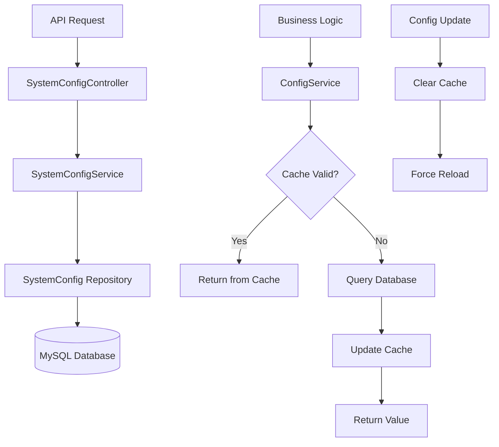

# 🔧 System Configuration Management

Hệ thống quản lý cấu hình tập trung cho Backend ChatBot Banking, cho phép quản lý động các tham số hệ thống mà không cần restart service.

## 📋 Mục lục

- [🎯 Tổng quan](#-tổng-quan)
- [🏗️ Kiến trúc](#️-kiến-trúc)
- [⚙️ Các Config Keys](#️-các-config-keys)
- [🚀 Cách sử dụng](#-cách-sử-dụng)
- [📡 API Endpoints](#-api-endpoints)
- [🌱 Setup & Seeding](#-setup--seeding)
- [✨ Best Practices](#-best-practices)
- [📝 Examples](#-examples)

## 🎯 Tổng quan

### Mục tiêu

Quản lý tập trung các cấu hình của hệ thống ChatBot Banking để:

- **Điều chỉnh ngưỡng AI confidence** mà không cần restart
- **Bật/tắt waiting message** động
- **Thay đổi chiến lược phân phối reviewer**
- **Cấu hình timeout và retry logic**
- **Quản lý theme frontend và notifications**

### Tính năng chính

- ✅ **In-memory caching** với TTL 5 phút
- ✅ **Type-safe configuration** với TypeScript enums
- ✅ **Permission-based access control**
- ✅ **Data type validation**
- ✅ **Audit trail** (track user tạo/sửa)
- ✅ **System config protection** (không thể xóa)
- ✅ **Default values & fallback**

## 🏗️ Kiến trúc

### Database Schema

```sql
CREATE TABLE system_configs (
  id VARCHAR(36) PRIMARY KEY,
  config_key ENUM(...) UNIQUE NOT NULL,
  config_value TEXT NOT NULL,
  data_type ENUM('string', 'number', 'boolean', 'json') DEFAULT 'string',
  description TEXT,
  is_active BOOLEAN DEFAULT TRUE,
  is_system_config BOOLEAN DEFAULT FALSE,
  created_at DATETIME NOT NULL,
  updated_at DATETIME NOT NULL,
  created_by VARCHAR(36),
  updated_by VARCHAR(36)
);
```

### Module Structure

```
src/modules/system-config/
├── entities/
│   └── system-config.entity.ts     # Entity & Enums
├── dto/
│   ├── create-config.dto.ts        # DTO tạo config
│   └── update-config.dto.ts        # DTO cập nhật config
├── examples/
│   └── config-usage.example.ts     # Examples sử dụng
├── system-config.controller.ts     # REST API endpoints
├── system-config.service.ts        # Business logic
└── system-config.module.ts         # Module definition

src/modules/global/services/
└── config.service.ts               # Shared ConfigService
```

### Data Flow



## ⚙️ Các Config Keys

### 🤖 AI Agent Configuration

| Key                       | Type   | Default | Description                                                 |
| ------------------------- | ------ | ------- | ----------------------------------------------------------- |
| `AI_CONFIDENCE_THRESHOLD` | number | 80      | Ngưỡng độ chính xác AI (0-100%) để quyết định auto response |

### 💬 Message Configuration

| Key                       | Type    | Default         | Description                                          |
| ------------------------- | ------- | --------------- | ---------------------------------------------------- |
| `ENABLE_WAITING_MESSAGE`  | boolean | true            | Có gửi waiting message khi chuyển sang manual review |
| `WAITING_MESSAGE_CONTENT` | string  | "Cảm ơn bạn..." | Nội dung waiting message gửi cho khách hàng          |

### 👥 Reviewer Configuration

| Key                        | Type   | Default       | Description                                                    |
| -------------------------- | ------ | ------------- | -------------------------------------------------------------- |
| `MAX_RETRY_COUNT`          | number | 3             | Số lần retry tối đa khi reviewer không phản hồi                |
| `REVIEWER_TIMEOUT_MINUTES` | number | 30            | Thời gian timeout cho reviewer (phút)                          |
| `AUTO_ASSIGN_STRATEGY`     | string | "round_robin" | Chiến lược phân phối: round_robin, load_based, expertise_based |

### 🖥️ System Configuration

| Key                             | Type    | Default | Description                               |
| ------------------------------- | ------- | ------- | ----------------------------------------- |
| `SYSTEM_MAINTENANCE_MODE`       | boolean | false   | Chế độ bảo trì hệ thống                   |
| `MAX_MESSAGES_PER_CONVERSATION` | number  | 100     | Số tin nhắn tối đa trong một conversation |
| `SESSION_TIMEOUT_MINUTES`       | number  | 480     | Thời gian timeout session (8 giờ)         |

### 🎨 Frontend Configuration

| Key             | Type   | Default | Description                 |
| --------------- | ------ | ------- | --------------------------- |
| `DEFAULT_THEME` | string | "light" | Theme mặc định: light, dark |

### 📧 Notification Configuration

| Key                          | Type    | Default | Description                   |
| ---------------------------- | ------- | ------- | ----------------------------- |
| `ENABLE_EMAIL_NOTIFICATIONS` | boolean | true    | Kích hoạt thông báo qua email |
| `ENABLE_SMS_NOTIFICATIONS`   | boolean | false   | Kích hoạt thông báo qua SMS   |

## 🚀 Cách sử dụng

### 1. Inject ConfigService

```typescript
import { Injectable } from '@nestjs/common';
import { ConfigService } from '../global/services/config.service';

@Injectable()
export class YourService {
  constructor(private readonly configService: ConfigService) {}
}
```

### 2. Lấy Config Values

```typescript
// Sử dụng convenient methods
const threshold = await this.configService.getAiConfidenceThreshold();
const isWaitingEnabled = await this.configService.isWaitingMessageEnabled();
const waitingMessage = await this.configService.getWaitingMessageContent();

// Sử dụng generic method với default value
const sessionTimeout = await this.configService.getConfig(
  ConfigKey.SESSION_TIMEOUT_MINUTES,
  480,
);

// Lấy nhiều configs cùng lúc
const configs = await this.configService.getMultipleConfigs([
  ConfigKey.AI_CONFIDENCE_THRESHOLD,
  ConfigKey.ENABLE_WAITING_MESSAGE,
  ConfigKey.MAX_RETRY_COUNT,
]);
```

### 3. Update Config (Admin only)

```typescript
// Cập nhật config
await this.configService.updateConfig(
  ConfigKey.AI_CONFIDENCE_THRESHOLD,
  85,
  userId,
);

// Refresh cache manually
await this.configService.refreshCache();
```

### 4. Business Logic Examples

#### Message Processing

```typescript
async processAIResponse(confidence: number) {
  const threshold = await this.configService.getAiConfidenceThreshold();

  if (confidence >= threshold) {
    return { shouldAutoReply: true };
  } else {
    const enableWaiting = await this.configService.isWaitingMessageEnabled();
    if (enableWaiting) {
      const waitingMessage = await this.configService.getWaitingMessageContent();
      return { shouldAutoReply: false, waitingMessage };
    }
    return { shouldAutoReply: false };
  }
}
```

#### Reviewer Assignment

```typescript
async assignToReviewer(customerType: string): Promise<string> {
  const strategy = await this.configService.getAutoAssignStrategy();

  switch (strategy) {
    case 'round_robin':
      return this.assignRoundRobin(customerType);
    case 'load_based':
      return this.assignLoadBased(customerType);
    case 'expertise_based':
      return this.assignExpertiseBased(customerType);
    default:
      return this.assignRoundRobin(customerType);
  }
}
```

#### Timeout Check

```typescript
async checkReviewerTimeout(assignedAt: Date): Promise<boolean> {
  const timeoutMinutes = await this.configService.getReviewerTimeoutMinutes();
  const timeoutMs = timeoutMinutes * 60 * 1000;

  return Date.now() - assignedAt.getTime() > timeoutMs;
}
```

## 📡 API Endpoints

### Authentication

Tất cả APIs yêu cầu:

- **JWT Authentication**: `Authorization: Bearer <token>`
- **Permission**: `PERMISSION` (chỉ admin)

### Endpoints

#### 📋 Lấy tất cả configs

```http
GET /system-config
```

**Response:**

```json
{
  "statusCode": 200,
  "message": "Lấy danh sách config thành công",
  "data": [
    {
      "id": "uuid",
      "configKey": "ai_confidence_threshold",
      "configValue": "80",
      "dataType": "number",
      "description": "Ngưỡng độ chính xác của AI Agent...",
      "isActive": true,
      "isSystemConfig": true,
      "createdAt": "2023-12-25T10:00:00.000Z",
      "updatedAt": "2023-12-25T10:00:00.000Z",
      "creator": {
        "id": "user-id",
        "username": "admin",
        "fullName": "System Admin"
      }
    }
  ]
}
```

#### 🔍 Lấy config theo key

```http
GET /system-config/{configKey}
```

#### ➕ Tạo config mới

```http
POST /system-config
Content-Type: application/json

{
  "configKey": "custom_config",
  "configValue": "value",
  "dataType": "string",
  "description": "Custom configuration",
  "isActive": true,
  "isSystemConfig": false
}
```

#### ✏️ Cập nhật config

```http
PUT /system-config/{configKey}
Content-Type: application/json

{
  "configKey": "ai_confidence_threshold",
  "configValue": "85",
  "description": "Updated threshold"
}
```

#### 🔄 Toggle status

```http
PUT /system-config/{configKey}/toggle-status
```

#### 🗑️ Xóa config

```http
DELETE /system-config/{configKey}
```

_Chỉ xóa được non-system configs_

#### 🔄 Refresh cache

```http
POST /system-config/refresh-cache
```

### Error Responses

```json
{
  "statusCode": 404,
  "message": "Config với key \"invalid_key\" không tồn tại"
}

{
  "statusCode": 400,
  "message": "AI Confidence Threshold phải là số từ 0 đến 100"
}

{
  "statusCode": 403,
  "message": "Không có quyền truy cập"
}
```

## 🌱 Setup & Seeding

### 1. Database Migration

Chạy migration để tạo bảng `system_configs`:

```sql
-- Tự động tạo khi start app với TypeORM synchronize
-- Hoặc generate migration:
npx typeorm migration:generate -n CreateSystemConfigs
```

### 2. Seed Default Configs

Chạy script để seed 12 default configs:

```bash
# Seed configs
npx ts-node scripts/seed-system-config.ts

# Output:
🌱 Seeding system config...
✅ Created config: ai_confidence_threshold
✅ Created config: enable_waiting_message
✅ Created config: waiting_message_content
...
✅ System config seeding completed!
```

### 3. Verify Setup

Kiểm tra configs đã được tạo:

```http
GET /system-config
Authorization: Bearer <admin-token>
```

## ✨ Best Practices

### 🔧 Configuration Management

1. **Sử dụng Enum cho Config Keys**

   ```typescript
   // ✅ GOOD
   await this.configService.getConfig(ConfigKey.AI_CONFIDENCE_THRESHOLD);

   // ❌ BAD
   await this.configService.getConfig('ai_confidence_threshold');
   ```

2. **Luôn có Default Values**

   ```typescript
   // ✅ GOOD
   const timeout = await this.configService.getConfig(
     ConfigKey.SESSION_TIMEOUT_MINUTES,
     480,
   );

   // ❌ BAD
   const timeout = await this.configService.getConfig(
     ConfigKey.SESSION_TIMEOUT_MINUTES,
   );
   ```

3. **Cache Warm-up cho Critical Configs**
   ```typescript
   async warmupConfigs(): Promise<void> {
     const criticalConfigs = [
       ConfigKey.AI_CONFIDENCE_THRESHOLD,
       ConfigKey.ENABLE_WAITING_MESSAGE,
       ConfigKey.MAX_RETRY_COUNT,
     ];

     await Promise.all(
       criticalConfigs.map(key => this.configService.getConfig(key))
     );
   }
   ```

### 🔒 Security

1. **Chỉ admin có quyền thay đổi config**
2. **System configs được bảo vệ khỏi việc xóa**
3. **Validation nghiêm ngặt cho critical configs**
4. **Audit trail cho mọi thay đổi**

### ⚡ Performance

1. **Sử dụng convenient methods** thay vì generic
2. **Batch load configs** khi cần nhiều giá trị
3. **Cache TTL 5 phút** - cân bằng freshness vs performance
4. **Preload critical configs** khi start app

### 📝 Monitoring

1. **Log config changes**

   ```typescript
   this.logger.log(`Config "${configKey}" updated by user ${userId}`);
   ```

2. **Monitor cache hit rate**
3. **Alert khi critical configs thay đổi**

## 📝 Examples

### Example 1: Message Flow với Config

```typescript
@Injectable()
export class MessageFlowService {
  constructor(private readonly configService: ConfigService) {}

  async processIncomingMessage(message: any): Promise<any> {
    // 1. Kiểm tra maintenance mode
    const isMaintenanceMode = await this.configService.getConfig(
      ConfigKey.SYSTEM_MAINTENANCE_MODE,
      false,
    );

    if (isMaintenanceMode) {
      return { status: 'maintenance', message: 'Hệ thống đang bảo trì' };
    }

    // 2. Gọi AI Agent
    const aiResponse = await this.callAIAgent(message);

    // 3. Kiểm tra confidence threshold
    const threshold = await this.configService.getAiConfidenceThreshold();

    if (aiResponse.confidence >= threshold) {
      // Auto response
      return {
        status: 'auto',
        response: aiResponse.content,
        confidence: aiResponse.confidence,
      };
    } else {
      // Manual review
      const reviewerId = await this.assignReviewer(message.customerType);

      // Gửi waiting message nếu enabled
      const enableWaiting = await this.configService.isWaitingMessageEnabled();
      let waitingMessage = null;

      if (enableWaiting) {
        waitingMessage = await this.configService.getWaitingMessageContent();
      }

      return {
        status: 'manual',
        reviewerId,
        waitingMessage,
        suggestedResponse: aiResponse.content,
        confidence: aiResponse.confidence,
      };
    }
  }

  private async assignReviewer(customerType: string): Promise<string> {
    const strategy = await this.configService.getAutoAssignStrategy();

    switch (strategy) {
      case 'round_robin':
        return this.roundRobinAssign(customerType);
      case 'load_based':
        return this.loadBasedAssign(customerType);
      case 'expertise_based':
        return this.expertiseBasedAssign(customerType);
      default:
        return this.roundRobinAssign(customerType);
    }
  }
}
```

### Example 2: Background Job với Config

```typescript
@Injectable()
export class ReviewerTimeoutJob {
  constructor(private readonly configService: ConfigService) {}

  @Cron('*/5 * * * *') // Chạy mỗi 5 phút
  async checkTimeouts(): Promise<void> {
    const timeoutMinutes = await this.configService.getReviewerTimeoutMinutes();
    const maxRetryCount = await this.configService.getMaxRetryCount();

    // Tìm các message đã timeout
    const timeoutMessages = await this.findTimeoutMessages(timeoutMinutes);

    for (const message of timeoutMessages) {
      if (message.retryCount < maxRetryCount) {
        // Retry - assign to another reviewer
        await this.reassignMessage(message);
      } else {
        // Max retry reached - escalate
        await this.escalateMessage(message);
      }
    }
  }
}
```

### Example 3: Dynamic Configuration Update

```typescript
@Injectable()
export class ConfigManagementService {
  constructor(
    private readonly configService: ConfigService,
    private readonly systemConfigService: SystemConfigService,
  ) {}

  async updateAIThreshold(newThreshold: number, userId: string): Promise<void> {
    // Validate
    if (newThreshold < 0 || newThreshold > 100) {
      throw new BadRequestException('Threshold phải từ 0-100');
    }

    // Update via SystemConfigService (includes validation & audit)
    await this.systemConfigService.updateConfig(
      ConfigKey.AI_CONFIDENCE_THRESHOLD,
      {
        configKey: ConfigKey.AI_CONFIDENCE_THRESHOLD,
        configValue: newThreshold.toString(),
      },
      userId,
    );

    // Log the change
    console.log(`AI Threshold updated to ${newThreshold}% by user ${userId}`);

    // Notify relevant services về thay đổi
    await this.notifyThresholdChange(newThreshold);
  }

  async bulkUpdateConfigs(updates: any[], userId: string): Promise<void> {
    for (const update of updates) {
      await this.systemConfigService.updateConfig(
        update.configKey,
        update,
        userId,
      );
    }

    // Refresh cache sau khi update xong
    await this.configService.refreshCache();
  }
}
```

---

## 🔗 Liên quan

- [API Documentation](./API-DOCUMENTATION.md)
- [Database Structure](./db_structure.md)
- [Project Overview](./project_overview.md)

---

_Tài liệu này được cập nhật lần cuối: 2023-12-25_
