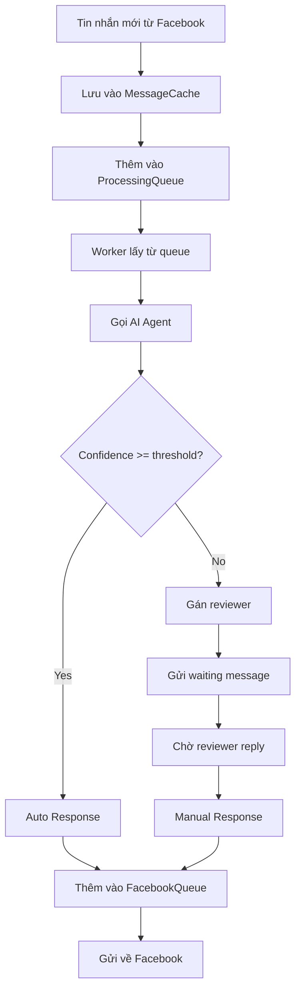

# 🚀 Redis Cache System - ChatBot Banking

Hệ thống Redis caching cho việc quản lý tin nhắn và conversation trong ChatBot Banking System.

## 📋 Tổng quan

Hệ thống Redis cache được thiết kế để:

- **Lưu trữ tin nhắn tạm thời** với các trạng thái xử lý khác nhau
- **Quản lý conversation** và phân gán reviewer
- **Queue system** với priority, retry và delay handling
- **Message routing** giữa AI Agent và Business Unit reviewers

## 🏗️ Kiến trúc

```
src/shared/redis/
├── services/
│   ├── message-cache.service.ts      # Quản lý cache tin nhắn
│   ├── conversation-cache.service.ts # Quản lý cache conversation
│   └── message-queue.service.ts      # Quản lý message queue
├── redis.module.ts                   # Redis module configuration
└── README.md                         # Tài liệu này

src/modules/chat/types/
└── message.types.ts                  # Type definitions và enums

src/modules/cache/
├── cache.controller.ts               # API endpoints để test và quản lý
├── cache.module.ts                   # Cache module
└── dto/test-message.dto.ts          # DTO cho testing
```

## 🔧 Configuration

### Environment Variables

Thêm vào file `.env`:

```env
# Redis Configuration
REDIS_HOST=localhost
REDIS_PORT=6379
REDIS_PASSWORD=
REDIS_DB=0
REDIS_URL=
REDIS_KEY_PREFIX=chatbot:
```

### Cài đặt Redis

#### Local Development (Docker)

```bash
# Chạy Redis với Docker
docker run -d \
  --name redis-chatbot \
  -p 6379:6379 \
  redis:7-alpine

# Hoặc với docker-compose
version: '3.8'
services:
  redis:
    image: redis:7-alpine
    ports:
      - "6379:6379"
    volumes:
      - redis_data:/data

volumes:
  redis_data:
```

#### Production

```bash
# Install Redis trên Ubuntu
sudo apt update
sudo apt install redis-server

# Start Redis service
sudo systemctl start redis
sudo systemctl enable redis
```

## 📚 Sử dụng Services

### 1. MessageCacheService

```typescript
import { MessageCacheService } from '../../shared/redis/services/message-cache.service';

@Injectable()
export class ChatService {
  constructor(private readonly messageCacheService: MessageCacheService) {}

  async handleNewMessage(messageData: any) {
    // Tạo cached message
    const cachedMessage: CachedMessage = {
      id: messageData.id,
      conversationId: messageData.conversationId,
      customerId: messageData.customerId,
      senderId: messageData.senderId,
      senderType: SenderType.CUSTOMER,
      content: messageData.content,
      status: MessageStatus.RECEIVED,
      createdAt: formatDateToISO(new Date()),
      updatedAt: formatDateToISO(new Date()),
    };

    // Lưu vào cache
    await this.messageCacheService.cacheMessage(cachedMessage);

    // Thêm vào processing queue
    await this.messageCacheService.addToProcessingQueue(
      cachedMessage.id,
      MessagePriority.NORMAL,
    );
  }
}
```

### 2. ConversationCacheService

```typescript
import { ConversationCacheService } from '../../shared/redis/services/conversation-cache.service';

@Injectable()
export class ConversationService {
  constructor(
    private readonly conversationCacheService: ConversationCacheService,
  ) {}

  async assignReviewer(conversationId: string, reviewerId: string) {
    // Gán reviewer cho conversation
    await this.conversationCacheService.assignReviewer(
      conversationId,
      reviewerId,
      'individual', // customer type
      30, // timeout 30 minutes
    );
  }
}
```

### 3. MessageQueueService

```typescript
import { MessageQueueService } from '../../shared/redis/services/message-queue.service';

@Injectable()
export class QueueWorkerService {
  constructor(private readonly messageQueueService: MessageQueueService) {}

  @Cron('*/10 * * * * *') // Every 10 seconds
  async processQueues() {
    // Xử lý delayed messages
    await this.messageQueueService.processDelayedMessages();

    // Xử lý AI response queue
    const aiMessages = await this.messageQueueService.dequeue(
      MessageAction.PROCESS_AI_RESPONSE,
      5,
    );

    for (const message of aiMessages) {
      await this.processAIResponse(message);
    }
  }
}
```

## 🎯 Message Flow

### Luồng xử lý tin nhắn mới



### Message Status Flow

```
RECEIVED
    ↓
WAIT_AI_AGENT
    ↓
AI_AGENT_DONE_AUTO ←→ AI_AGENT_DONE_NEED_MANUAL
    ↓                        ↓
AUTO_RESPONSE_DONE      SENT_TO_REVIEWER
    ↓                        ↓
Done                   REVIEWER_REPLIED
                            ↓
                    MANUAL_RESPONSE_DONE
                            ↓
                        Done
```

## 🛠️ API Testing

### Health Check

```bash
GET /api/cache/health
Authorization: Bearer <admin-token>
```

### Tạo test message

```bash
POST /api/cache/test/message
Authorization: Bearer <admin-token>
Content-Type: application/json

{
  "content": "Test message từ customer",
  "senderType": "customer",
  "status": "received",
  "confidence": 75,
  "addToQueue": true,
  "priority": 2
}
```

### Lấy thống kê cache

```bash
GET /api/cache/stats
Authorization: Bearer <admin-token>
```

### Xử lý queue (simulate worker)

```bash
POST /api/cache/process/queue?count=5
Authorization: Bearer <admin-token>
```

## 📊 Monitoring

### Redis Keys Structure

```
chatbot:message:{messageId}              # Cached message data
chatbot:conversation:{conversationId}    # Cached conversation data
chatbot:processing:messages              # Processing queue (sorted set)
chatbot:pending_facebook:messages        # Facebook response queue
chatbot:queue:{action}                   # Action-specific queues
chatbot:delayed_queue:messages           # Delayed/scheduled messages
chatbot:dead_letter_queue               # Failed messages
chatbot:active_conversations            # Active conversation set
chatbot:customer_conversations:{customerId} # Customer's conversations
chatbot:reviewer_assignments:{conversationId} # Reviewer assignments
```

### Cache Stats API

Endpoint: `GET /api/cache/stats`

Response:

```json
{
  "statusCode": 200,
  "message": "Lấy thống kê cache thành công",
  "data": {
    "messages": {
      "totalMessages": 150,
      "processingQueue": 5,
      "pendingFacebook": 3,
      "statusBreakdown": {
        "received": 10,
        "wait_ai_agent": 5,
        "ai_agent_done_auto": 80,
        "sent_to_reviewer": 15,
        "reviewer_replied": 40
      }
    },
    "conversations": {
      "totalConversations": 45,
      "activeConversations": 12,
      "statusBreakdown": {
        "active": 12,
        "waiting_review": 8,
        "in_review": 5,
        "resolved": 20
      }
    },
    "queues": {
      "queueSizes": {
        "process_ai_response": 3,
        "send_to_facebook": 2,
        "assign_to_reviewer": 1
      },
      "delayedCount": 5,
      "deadLetterCount": 0
    }
  }
}
```

## 🚨 Error Handling

### Retry Logic

- **Max retries**: 3 lần mặc định
- **Retry delay**: 60 giây, tăng exponential
- **Dead letter queue**: Messages vượt quá max retries

### Timeout Handling

- **Reviewer timeout**: 30 phút mặc định
- **AI Agent timeout**: 30 giây
- **Processing timeout**: Configurable per message type

## 🔄 Maintenance

### Cleanup Jobs

```typescript
@Cron('0 2 * * *') // Daily at 2 AM
async dailyCleanup() {
  // Cleanup expired messages (>7 days)
  await this.messageCacheService.cleanupExpiredMessages();

  // Cleanup expired conversations (>30 days, closed status)
  await this.conversationCacheService.cleanupExpiredConversations();

  // Cleanup old queue items (>7 days)
  await this.messageQueueService.cleanupOldQueueItems();
}

@Cron('*/5 * * * *') // Every 5 minutes
async timeoutCheck() {
  // Check và reassign timeout reviewers
  const timeoutAssignments = await this.conversationCacheService.checkTimeoutAssignments();

  for (const assignment of timeoutAssignments) {
    await this.reassignToOtherReviewer(assignment);
  }
}
```

## 🔧 Performance Tips

1. **Redis Memory Optimization**

   - Sử dụng TTL cho các keys không quan trọng
   - Compress large JSON objects nếu cần
   - Monitor memory usage với `INFO memory`

2. **Queue Processing**

   - Batch process multiple messages
   - Use pipeline for bulk operations
   - Implement circuit breaker cho external calls

3. **Monitoring**
   - Setup Redis monitoring (RedisInsight, Grafana)
   - Track queue sizes và processing times
   - Alert on dead letter queue growth

## 🐛 Troubleshooting

### Common Issues

1. **Redis Connection Failed**

   ```bash
   # Check Redis status
   redis-cli ping

   # Check connection from app
   GET /api/cache/health
   ```

2. **Queue Stuck**

   ```bash
   # Check queue sizes
   GET /api/cache/stats

   # Process queue manually
   POST /api/cache/process/queue
   ```

3. **Memory Issues**

   ```bash
   # Check Redis memory
   redis-cli info memory

   # Run cleanup
   DELETE /api/cache/cleanup
   ```

## 📚 References

- [Redis Documentation](https://redis.io/documentation)
- [@nestjs-modules/ioredis](https://github.com/nestjs/ioredis)
- [NestJS Caching](https://docs.nestjs.com/techniques/caching)

---

**💡 Tip**: Luôn test Redis cache system với `GET /api/cache/health` trước khi deploy production!
